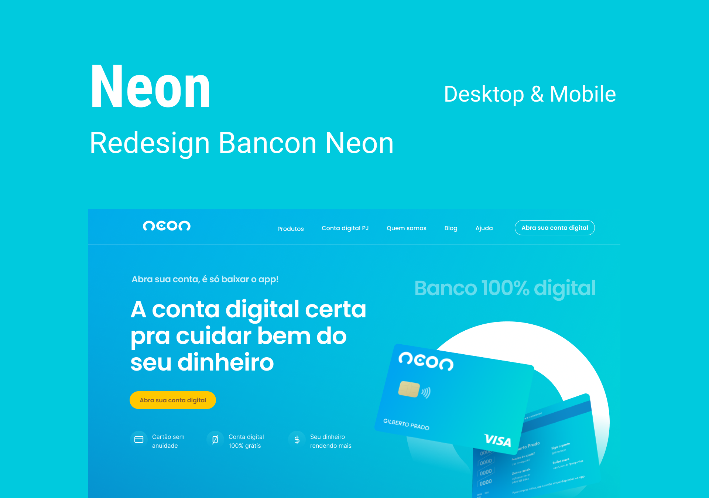

  

  
  
       

  

<h1 align="center">
    
</h1>

 

## 🧪 Technologies

This project was developed using the following technologies:

- [JavaScript](https://www.javascript.com/)
- [SASS](https://sass-lang.com/)

## 🔖 Layout

You can view the project layout through the links below:

- [Layout](https://www.figma.com/file/hRBV5sZsjpJlMrHYQC5jKc/Projeto-Web---Banco-Neon-Redesign-(Copy)?node-id=1%3A21) 

Remembering that you need to have a [Figma](http://figma.com/) account to access it.

## 📝 License

This project is licensed under the MIT License. See the [LICENSE](LICENSE.md) file for details.

---

Made with 💜 by Gustavo Henrique
